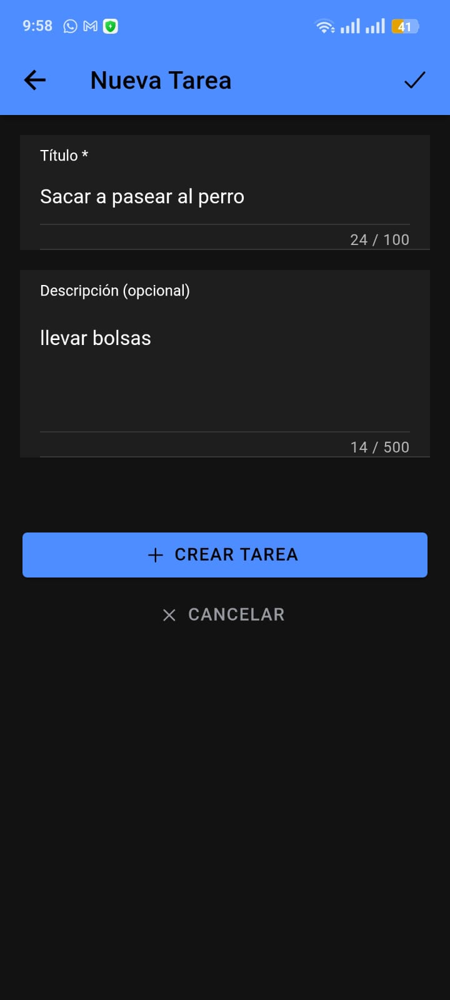
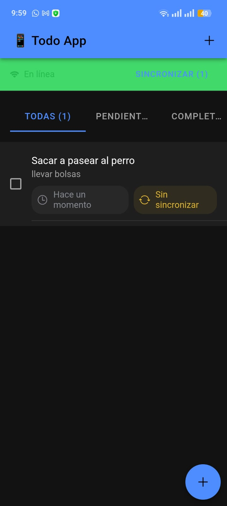
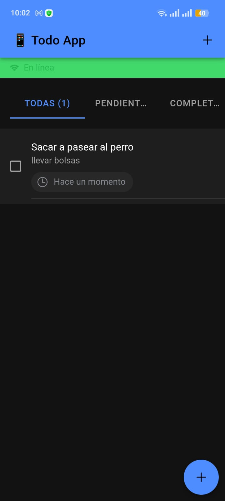
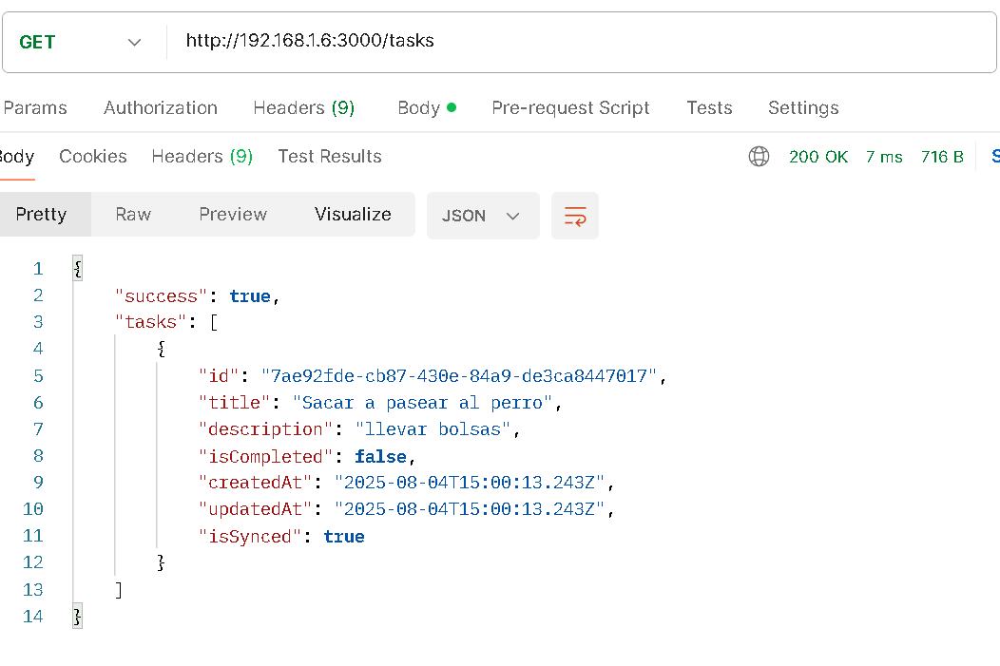

# 📱 Todo App - Ionic + Capacitor + Node.js

Una aplicación completa de gestión de tareas (TODO) con arquitectura cliente-servidor, desarrollada con **Ionic + Angular + Capacitor** para el frontend móvil y **Node.js + Express** para el backend API. La aplicación funciona tanto online como offline con sincronización automática.

## 🚀 Características principales

- ✅ **CRUD completo**: Crear, leer, editar y eliminar tareas
- 📱 **Multiplataforma**: Funciona en Android, iOS y web
- 🔄 **Sincronización automática**: Entre dispositivo local y servidor
- 💾 **Persistencia offline**: SQLite local para uso sin conexión
- 🌐 **API REST**: Backend escalable con Node.js y Express
- 📦 **APK nativo**: Instalación directa en Android
- 🎨 **UI moderna**: Interfaz responsiva con Ionic Framework
- 🔒 **Permisos de red**: Configurado para comunicación HTTP

## 🏗️ Arquitectura del Sistema

```
┌─────────────────┐    HTTP/REST    ┌─────────────────┐
│   Frontend      │◄──────────────►│   Backend       │
│   (todoApp)     │                │   (todo-api)    │
│                 │                │                 │
│ • Angular 20    │                │ • Node.js       │
│ • Ionic 8       │                │ • Express       │
│ • Capacitor 7   │                │ • CORS enabled  │
│ • SQLite local  │                │ • JSON API      │
└─────────────────┘                └─────────────────┘
```

## 🛠️ Stack Tecnológico

### **Backend API (todo-api)**
- **Runtime**: Node.js 18+
- **Framework**: Express.js
- **Middleware**: 
  - `cors` - Cross-Origin Resource Sharing
  - `express.json()` - Parse JSON bodies
- **Arquitectura**: RESTful API
- **Endpoints**: CRUD operations + sync endpoint
- **Puerto**: 3000 (configurable)
- **Host**: 0.0.0.0 (accesible desde red local)

### **Frontend Mobile (todoApp)**
- **Framework**: Angular 20
- **UI Library**: Ionic Framework 8
- **Mobile Runtime**: Capacitor 7
- **Base de datos local**: SQLite (via @capacitor-community/sqlite)
- **HTTP Client**: Angular HttpClient
- **Async handling**: RxJS (firstValueFrom)
- **Arquitectura**: 
  - Services (SyncService, SqliteApiFallbackService)
  - Components (HomePage, TaskForm)
  - Models (Task interface)

### **Dependencias principales**

#### Backend
```json
{
  "express": "^4.x",
  "cors": "^2.x"
}
```

#### Frontend
```json
{
  "@angular/core": "^20.x",
  "@ionic/angular": "^8.x",
  "@capacitor/core": "^7.x",
  "@capacitor/android": "^7.x",
  "@capacitor-community/sqlite": "^6.x",
  "rxjs": "^7.x"
}
```

## 📊 Modelo de Datos

### Task Interface
```typescript
interface Task {
  id: string;           // UUID único
  title: string;        // Título de la tarea
  description?: string; // Descripción opcional
  isCompleted: boolean; // Estado de completado
  createdAt: string;    // Fecha de creación (ISO)
  updatedAt: string;    // Fecha de actualización (ISO)
  isSynced: boolean;    // Flag de sincronización
}
```

## 🔧 Configuración e Instalación

### **1. Backend API (todo-api)**

#### Prerrequisitos
- Node.js 18 o superior
- npm o yarn

#### Instalación y ejecución
```bash
# 1. Navegar a la carpeta del backend
cd todo-api

# 2. Instalar dependencias
npm install

# 3. Ejecutar servidor en desarrollo
npm start
# o
node index.js

# 4. Verificar que funciona
# El servidor debe iniciarse en: http://0.0.0.0:3000
# Accessible desde la red local en: http://[TU_IP]:3000
```

#### ⚠️ Configuración de Red
El backend debe ejecutarse con `0.0.0.0` para ser accesible desde dispositivos móviles:

```javascript
// En tu archivo principal (index.js)
app.listen(3000, '0.0.0.0', () => {
  console.log('API escuchando en 0.0.0.0:3000');
});
```

#### Endpoints disponibles
- `GET /tasks` - Listar todas las tareas
- `POST /tasks` - Crear nueva tarea
- `PUT /tasks/:id` - Actualizar tarea existente
- `DELETE /tasks/:id` - Eliminar tarea
- `POST /tasks/sync` - Sincronización masiva

### **2. Frontend Mobile (todoApp)**

#### Prerrequisitos
- Node.js 18 o superior
- Ionic CLI: `npm install -g @ionic/cli`
- Capacitor CLI: `npm install -g @capacitor/cli`
- Android Studio (para build Android)
- Java JDK 8 o superior

#### Instalación
```bash
# 1. Navegar a la carpeta del frontend
cd todoApp

# 2. Instalar dependencias
npm install

# 3. Instalar plugins de Capacitor
npx cap sync
```

#### Configuración de la API
Editar `src/app/services/sync.service.ts`:
```typescript
private apiUrl = 'http://[TU_IP_LOCAL]:3000/tasks';
// Ejemplo: 'http://192.168.1.100:3000/tasks'
```

#### Ejecución en desarrollo web
```bash
# Servidor de desarrollo
ionic serve

# Accesible en: http://localhost:8100
```

#### Ejecución en Android

##### Opción 1: Android Studio (Recomendado)
```bash
# 1. Build del proyecto
ionic build

# 2. Sincronizar con Capacitor
npx cap sync android

# 3. Abrir en Android Studio
npx cap open android

# 4. En Android Studio:
#    - Conectar dispositivo USB o iniciar emulador
#    - Click en "Run" o usar Shift+F10
```

##### Opción 2: APK directo

###### **Método A: Desde Terminal**
```bash
# 1. Build del proyecto
ionic build
npx cap sync android

# 2. Generar APK desde terminal
cd android
./gradlew assembleDebug

# 3. El APK se genera en:
# android/app/build/outputs/apk/debug/app-debug.apk
```


###### **Método B: Build directo en Android Studio**
1. **Preparar proyecto**: `ionic build && npx cap sync android && npx cap open android`
2. **En Android Studio**:
   - **Build** → **Build Bundle(s) / APK(s)** → **Build APK(s)**
   - Esperar compilación
   - Click en **"locate"** cuando termine
3. **APK generado en**: `android/app/build/outputs/apk/debug/app-debug.apk`

#### ⚠️ Configuración de permisos Android
El archivo `android/app/src/main/AndroidManifest.xml` debe contener:

```xml
<manifest xmlns:android="http://schemas.android.com/apk/res/android">
    <!-- Permisos de red -->
    <uses-permission android:name="android.permission.INTERNET" />
    <uses-permission android:name="android.permission.ACCESS_NETWORK_STATE" />
    
    <application 
        android:usesCleartextTraffic="true">
        <!-- Permite HTTP (no solo HTTPS) -->
    </application>
</manifest>
```

## 🔄 Funcionamiento de la Sincronización

### Flujo de datos
1. **Creación offline**: Las tareas se guardan en SQLite local con `isSynced: false`
2. **Sincronización automática**: Cuando hay conexión, `SyncService` envía tareas no sincronizadas
3. **Descarga de cambios**: Obtiene tareas actualizadas del servidor
4. **Merge inteligente**: Combina datos locales y remotos sin duplicados


## 📱 Funcionalidades de la App

### Pantalla Principal (Home)
- **Lista de tareas**: Muestra todas las tareas con estado visual
- **Botón de sync**: Sincronización manual con el servidor
- **Agregar tarea**: Acceso rápido para crear nuevas tareas
- **Estados visuales**: Indicadores de completado y sincronización

### Gestión de Tareas
- **Crear**: Formulario con título y descripción
- **Editar**: Modificación in-place de tareas existentes
- **Completar**: Toggle de estado completado/pendiente
- **Eliminar**: Borrado con confirmación

### Persistencia y Sincronización
- **SQLite local**: Almacenamiento offline con @capacitor-community/sqlite
- **Sync automático**: Detección de conexión y sincronización inteligente
- **Manejo de errores**: Logs detallados y alertas al usuario
- **Estado de sincronización**: Indicadores visuales de estado

## 🔍 Troubleshooting

### Error: "status: 0, statusText: Unknown Error"
- **Causa**: Dispositivo no puede conectar con el backend
- **Solución**: 
  1. Verificar que el backend esté ejecutándose en `0.0.0.0:3000`
  2. Confirmar que móvil y PC estén en la misma red WiFi
  3. Probar acceso desde navegador móvil: `http://[IP_PC]:3000/tasks`
  4. Revisar firewall de Windows (permitir puerto 3000)

### Error: "CreateConnection: Connection todoapp already exists"
- **Causa**: SQLite intenta crear conexión múltiples veces
- **Solución**: Error no crítico, se puede ignorar o implementar singleton pattern

### Build Android falla
- **Verificar**: Java JDK, Android SDK, variables de entorno
- **Limpiar cache**: `npx cap sync android --force`


## 📄 Estructura del Proyecto

```
ionic-capacitor-app/
├── todo-api/                 # Backend Node.js + Express
│   ├── index.js             # Servidor principal
│   ├── package.json         # Dependencias backend
│   └── ...
├── todoApp/                 # Frontend Ionic + Angular
│   ├── src/
│   │   ├── app/
│   │   │   ├── services/    # SyncService, SQLite
│   │   │   ├── home/        # Página principal
│   │   │   └── models/      # Interfaces TypeScript
│   │   └── ...
│   ├── android/             # Proyecto Android nativo
│   ├── capacitor.config.ts  # Configuración Capacitor
│   └── package.json         # Dependencias frontend
└── README.md               # Este archivo
```

## 👨‍💻 Autor

**Juan Guillermo Caicedo**  
*Full-Stack Developer*

---

## 📸 Screenshots

*(Aquí se pueden agregar capturas de pantalla de la aplicación funcionando)*

**Lista de Tareas**
![Pantalla principal con lista de tareas]


**Crear Nueva Tarea**
![Formulario de creación de tareas]


**Sincronización** (precionando el botón)
![Proceso de sincronización con servidor]



**Lista de Tareas** (lista de tareas directamente de la API)

---

*Proyecto completamente funcional - Listo para producción*
